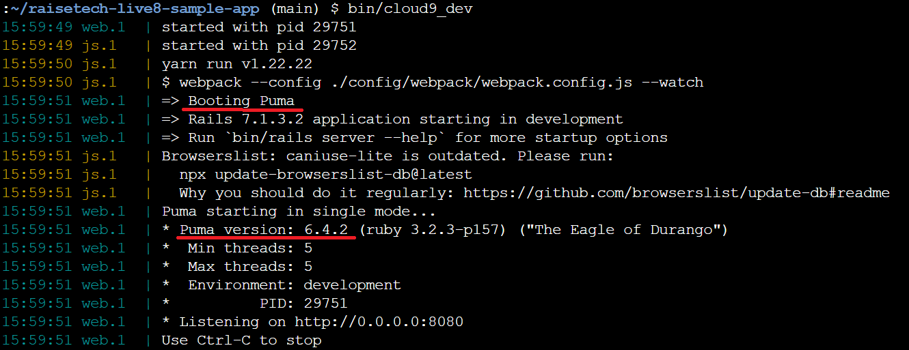
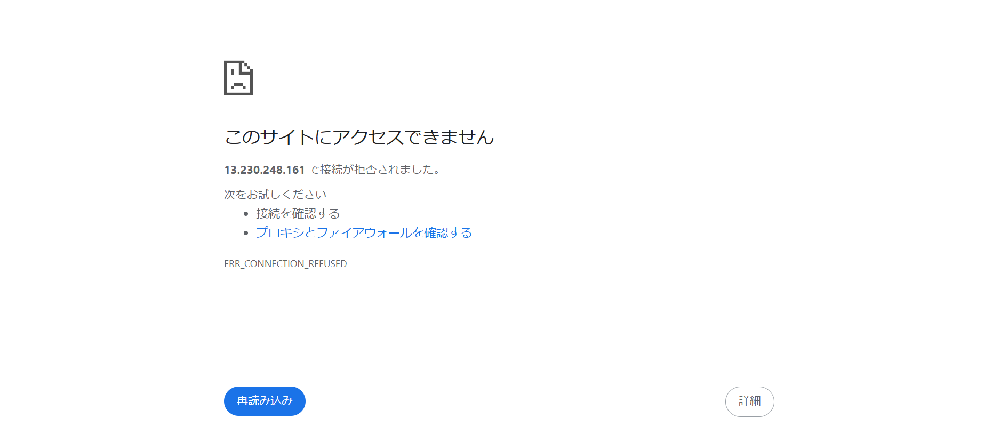
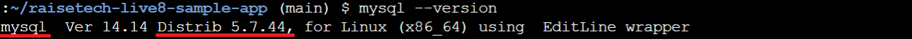
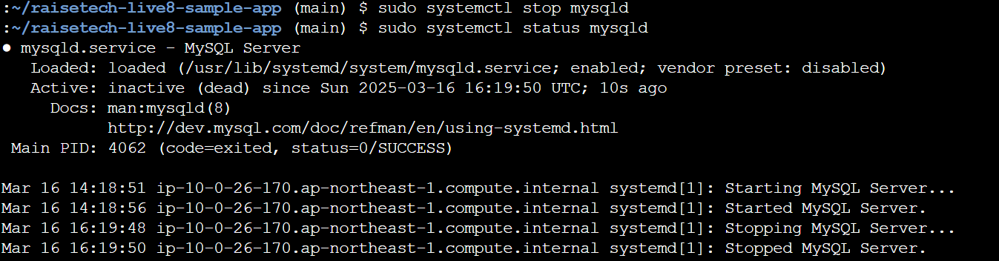
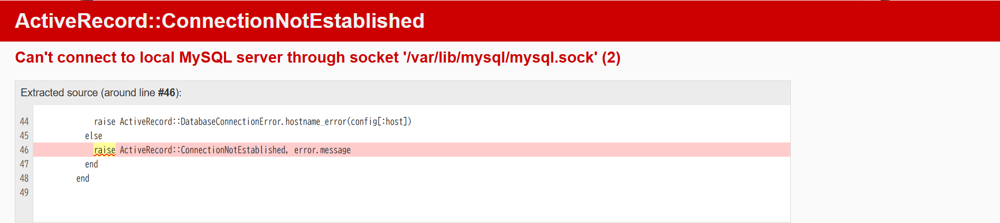
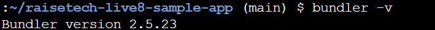

## 1.AP サーバーについて調べる

Q. AP サーバーの名前とバージョンは？

A. Puma 6.4.2

エビデンス画像

---

Q. AP サーバーを終了させた場合、引き続きアクセスできるか？

A. できない。

エビデンス画像

## 2.DB サーバーについて調べる

Q. DB サーバーの名前とバージョンは？

A. MySQL 5.7.44

エビデンス画像

---

Q. DB サーバーを終了させた場合、引き続きアクセスできるか？

A. できない。

エビデンス画像

---

Q. Rails の構成管理ツールは？

A. Bundler

エビデンス画像

## 3.学んだこと、感じたこと

- Web アプリケーションに関わるキーワードを復習する良い機会になりました。
- Ruby に触れたことがなかったので、Gem や Bundler は初めて知りました。
- Java でポートフォリオを作成していた時はアプリケーションサーバーを意識していませんでした。今後の開発では、トラブルシューティングを迅速に行えるよう、意識したいと思います。
- この講座の本旨ではないと思いますが、MySQL 等の環境構築にかなり時間がかかりました。これから慣れていきたいと思います。
