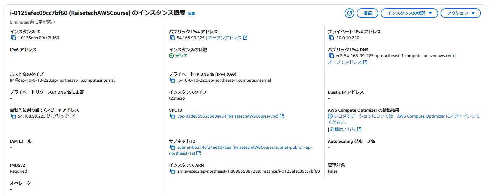
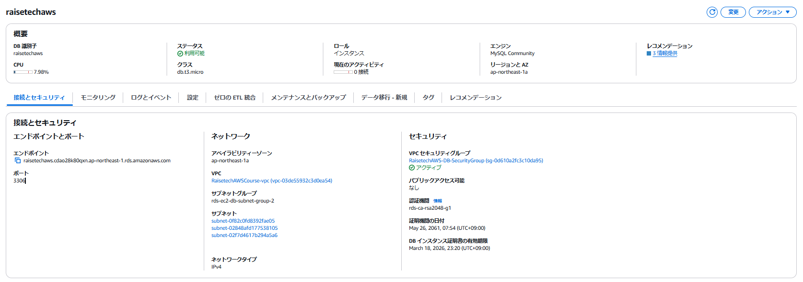
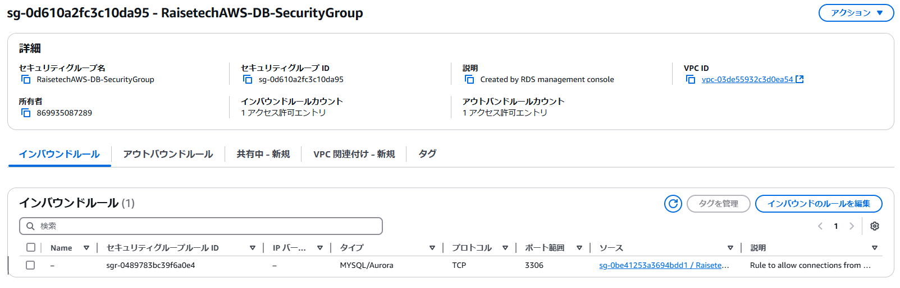
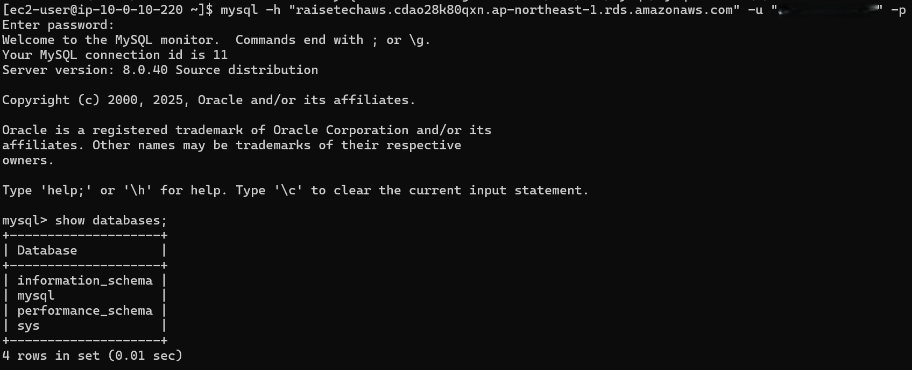

## 1. VPC の作成

### 概要

## 2. EC2 の作成

### 概要

---

### セキュリティグループのルール

HTTP/HTTPS および MyIP アドレスからの SSH を許可するインバウンドルール

外部への通信を許可するアウトバウンドルール

RDS への接続を許可するアウトバウンドルール

## 3. RDS の作成

### 概要

---

### サブネットグループ

---

### セキュリティグループのルール

MyIP アドレスから MySQL への接続を許可するインバウンドルール

EC2 からの MySQL への接続を許可するインバウンドルール

外部への通信を許可するアウトバウンドルール

## 4. EC2 から RDS への接続確認

