## 1. EC2 にサンプルアプリケーションをデプロイ

### Puma のみで動作確認

Puma の起動状態確認
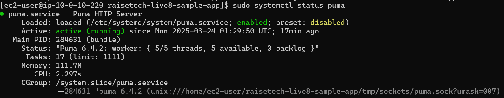

Curl で動作確認
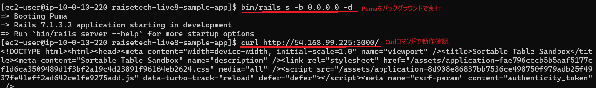

### Puma ＋ Unix Socket を使った動作確認

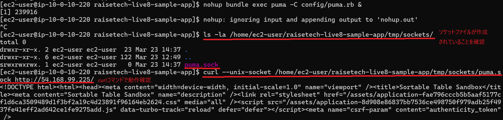

### Nginx の起動確認

Nginx の起動状態確認
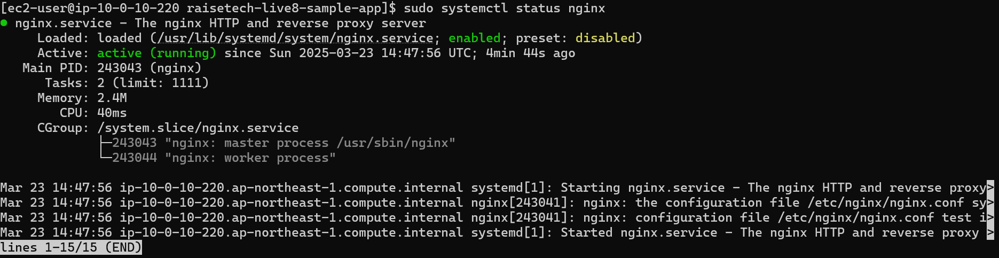

ブラウザで表示
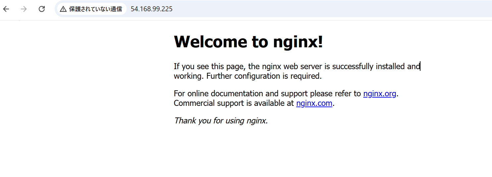

### Puma ＋ Unix Socket ＋ Nginx で動作確認

Curl で動作確認
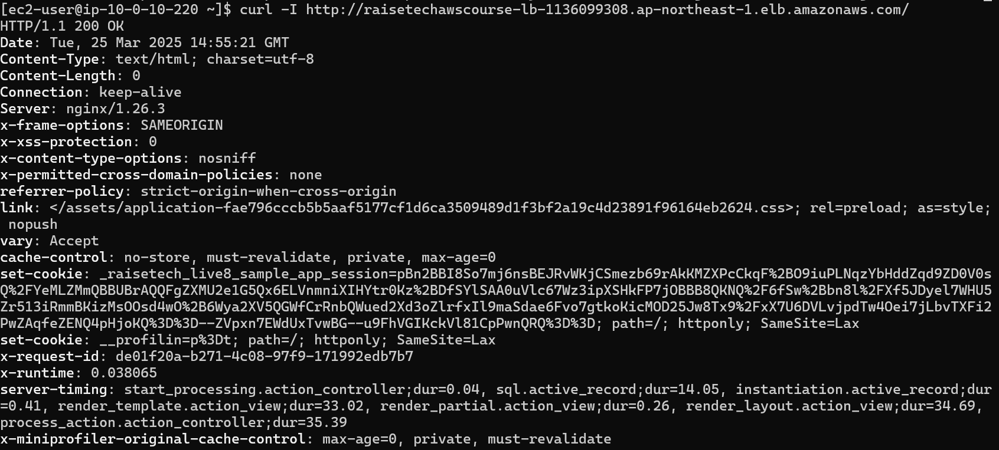

ブラウザで動作確認
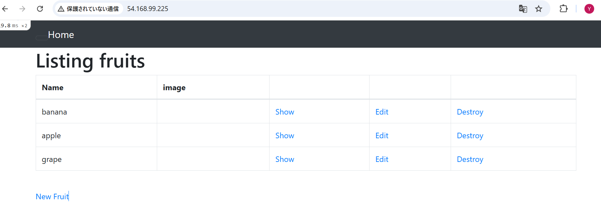

## 2. ALB の作成および動作確認

### マネジメントコンソール画面

ALB の概要
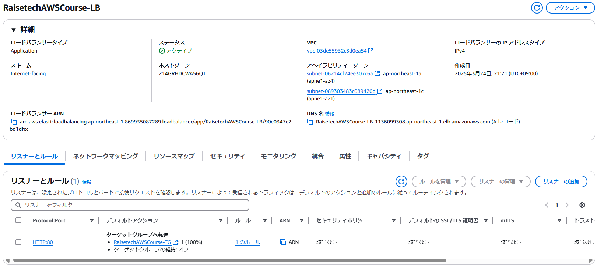

ターゲットグループの概要
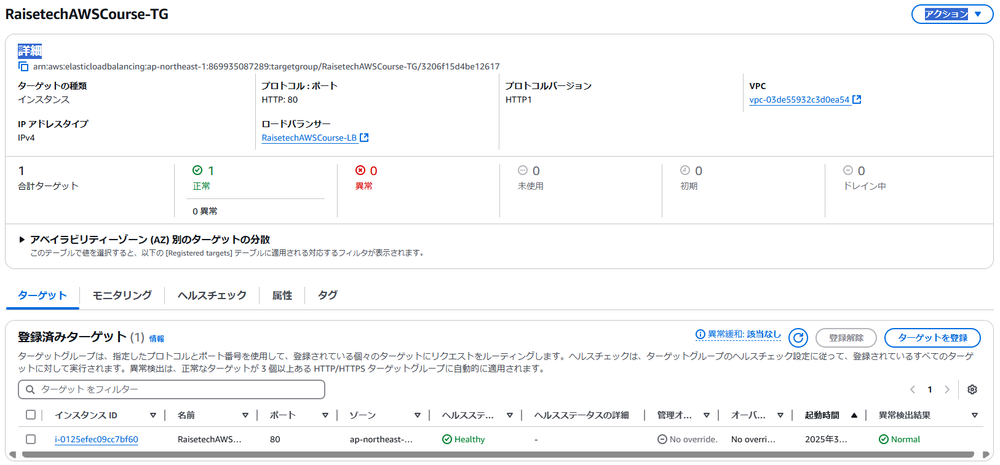

### ALB 経由での動作確認

ブラウザで動作確認
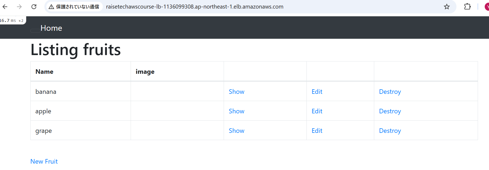

## 3. S3 の作成およびアプリケーション画像のアップロード・閲覧

### マネジメントコンソール画面

S3 の概要
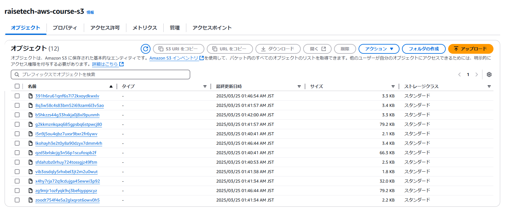

S3 のアクセス許可設定
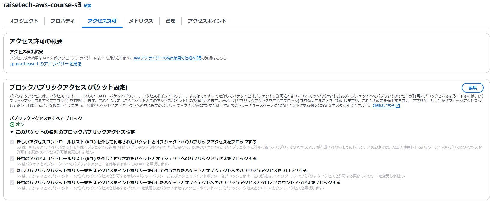

S3 の ACL 設定
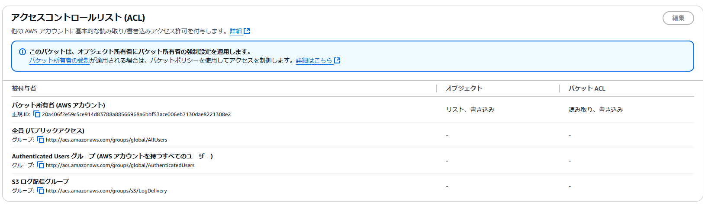

S3 にアクセスするための IAM ロール作成
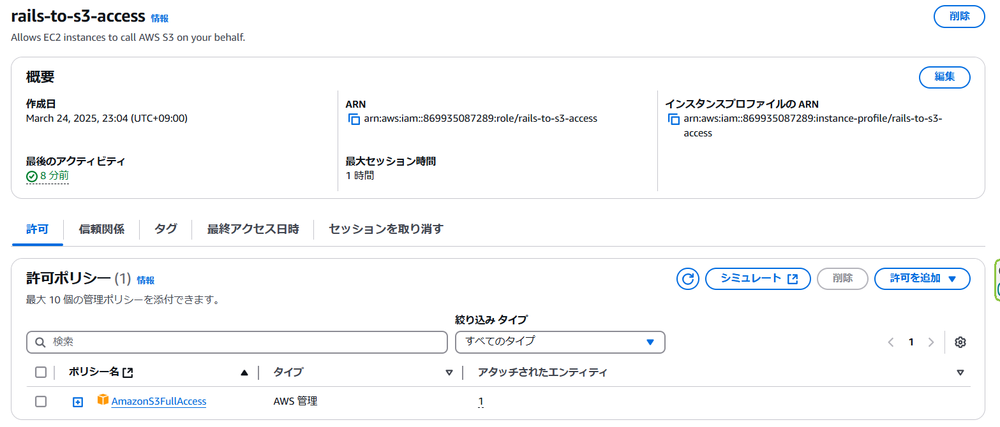

EC2 に S3 にアクセスするための IAM ロールをアタッチ
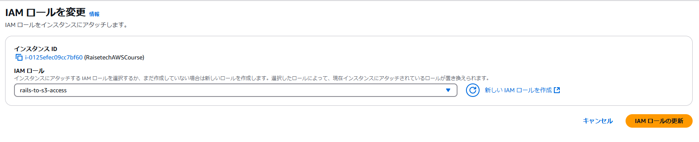

### アプリケーション側で S3 にアクセスする設定

config/environments/development.rb の設定
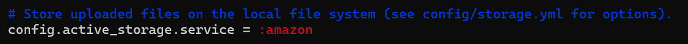

config/storage.yml の設定
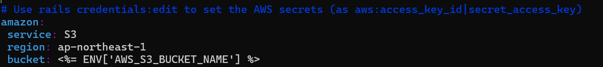

S3 のバケットネームを.bash_profile に環境変数として設定
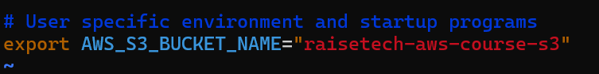

### S3 の動作確認

※画像がアップロードされている
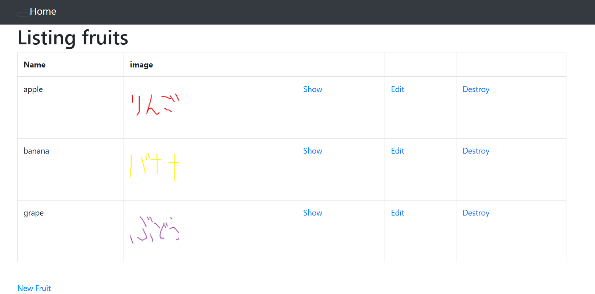

## 4. インフラ構成図

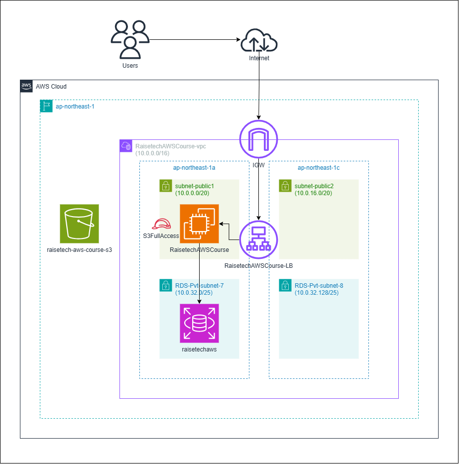
