## CloudTrail で 3/26 に AWS 利用したイベントを探し出す

### 探し出したイベントの概要

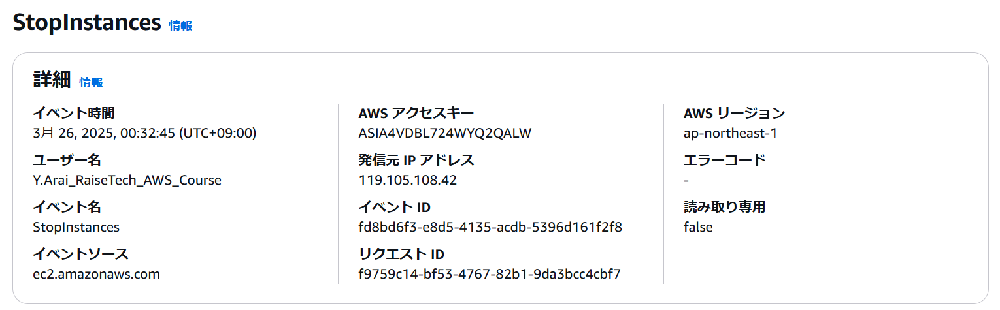

### イベント名称と内容３点

イベント名(eventName)

- インスタンスの停止(StopInstance)

情報

- イベント発生日時（eventSource）：2025 年 3 月 25 日 15 時 32 分 45 秒(UTC)
- リクエストが行われた AWS サービス(eventSource)：EC2
- リクエストが行われた IP アドレス(sourceIPAddress)：119.105.108.42

### 上記３点が該当するイベントレコード箇所

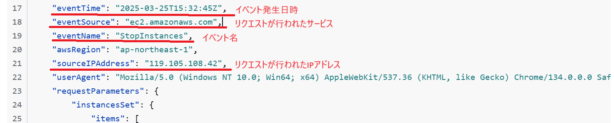

## CloudWatch アラームを使って ALB アラームを設定

### アプリケーションが使えなくなったときの動作

※Puma と Nginx を停止してアプリを使用不可とした

マネジメントコンソール画面
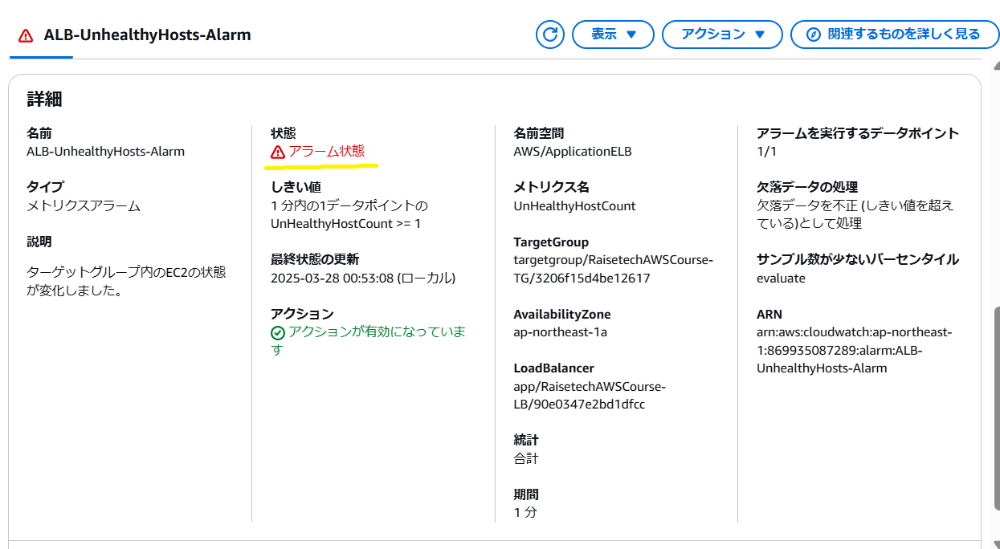

通知メール
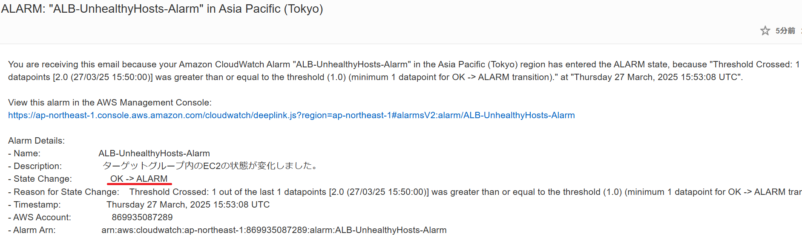

### アプリケーションが使えるようになったときの動作

※Puma と Nginx を起動してアプリを使用可能とした

マネジメントコンソール画面
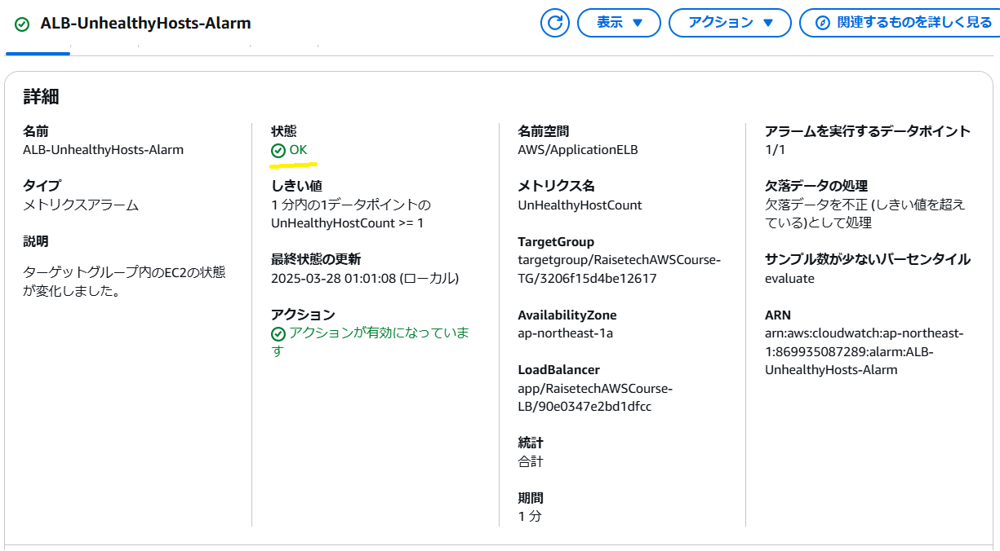

通知メール
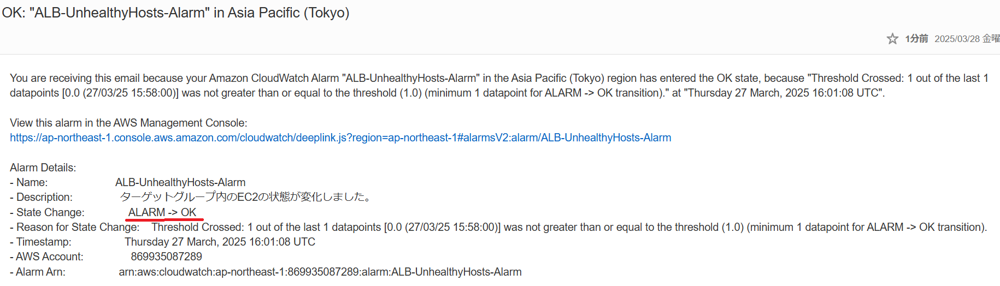

## AWS 利用料の見積もりと現在の利用料

### 見積もり

https://calculator.aws/#/estimate?id=78273ab92d89e29ec0f4c5ac8d68fefd727e3495

### 先月（２月）の利用料

#### 総計：$7.95（税抜$7.23）

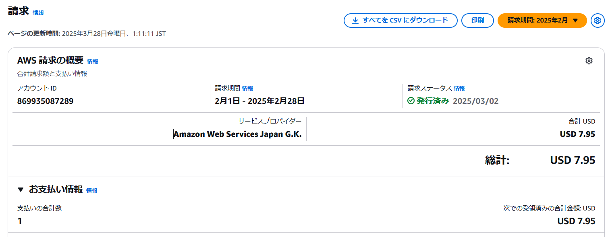

#### EC2 の料金：$0

利用時間 750.0 Hrs 以下、EBS 利用が 30GB 以下のため、無料利用枠で収まっている

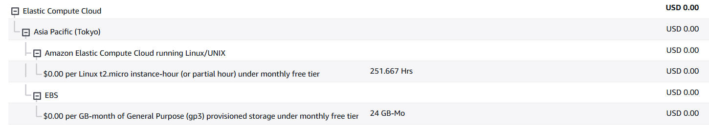

#### RDS の料金：$0

利用時間 750.0 Hrs 以下、ストレージ 利用が 20GB 以下のため、無料利用枠で収まっている

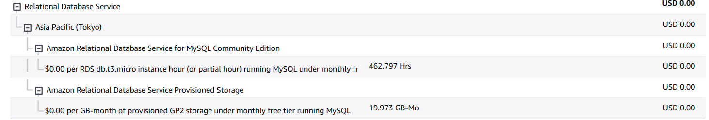

#### ALB の料金：$0

利用時間 750.0 Hrs 以下、15 LCU 以下のため、無料利用枠で収まっている
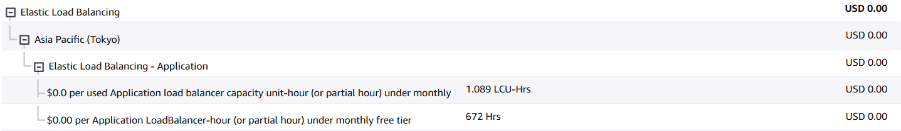

#### VPC の料金：$6.73

EC2 に割り当てられているパブリック IPv4 は無料枠（750 時間以内）のため、費用ゼロ。

ALB に割り当てられるパブリック IPv4 には無料利用枠がないため、1 アドレス 1 時間あたり 0.005 ドルの費用が発生。ALB 稼働時間は 672 時間/月だが、ALB は二つの AZ に存在するため、二つのパブリック IPv4 アドレスを占有することから、672×2≒1345 時間の使用量となっている。

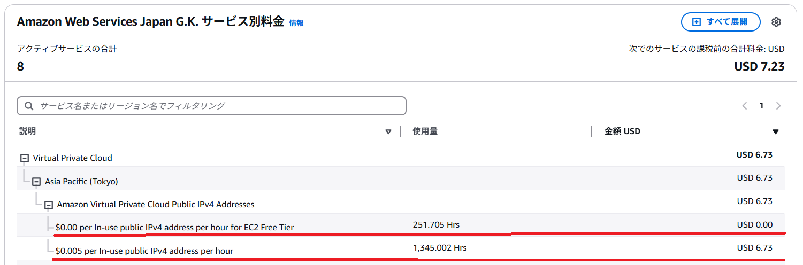

#### Route53 の料金：$0.50

ホストゾーンを一つ設定しているため発生。

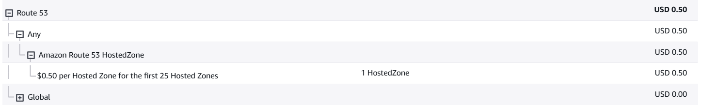
